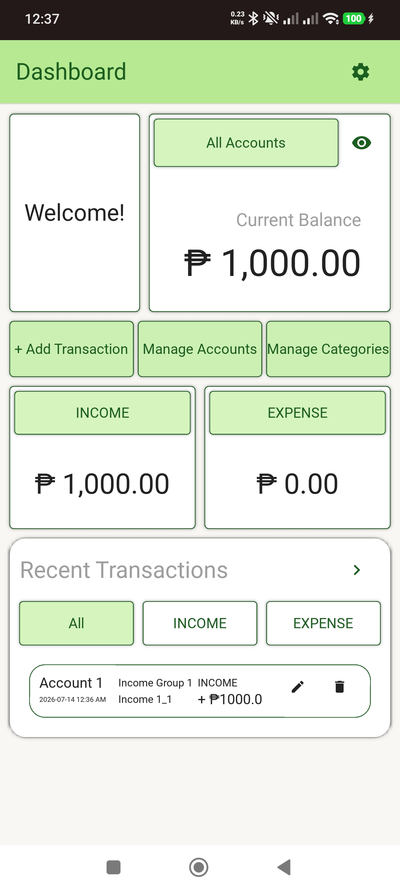
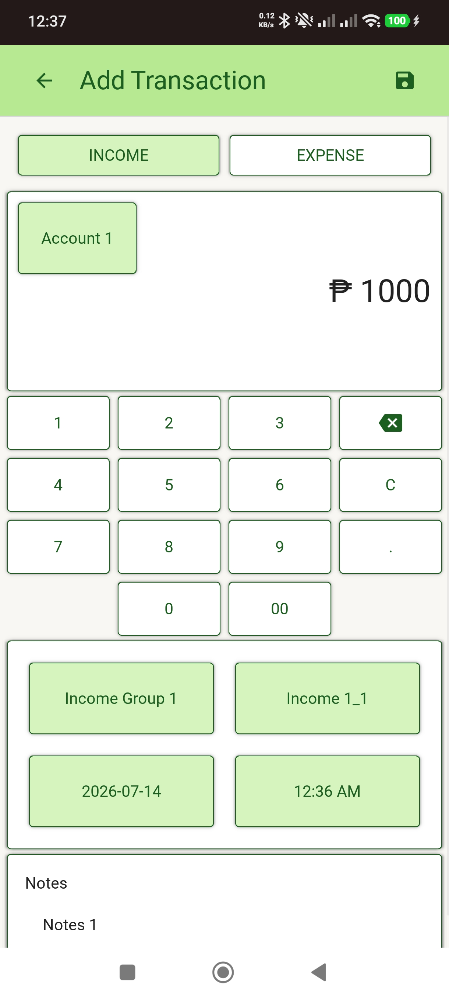
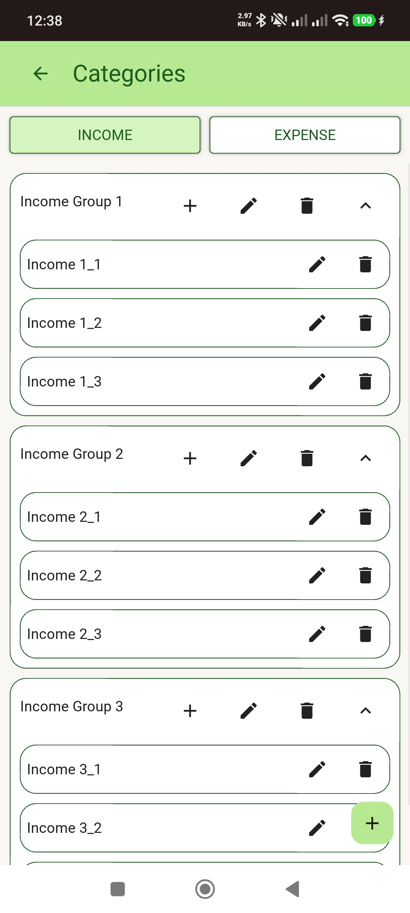

# Enkryon

A personal finance tracker mobile application built with **Python**, **Kivy**, **KivyMD**, and **SQLite**.

Enkryon helps users manage their personal finances by tracking income and expenses, organizing categories, managing accounts, and viewing transaction history. The application focuses on a clean mobile UI with local data storage and offline functionality.

---

## Features

## Dashboard

- View current balance
- View total income
- View total expenses
- Filter transactions by account
- Quick access to application features

---

## Transactions

- Add income and expense transactions
- Edit transactions
- Delete transactions
- Custom numeric keypad for entering amounts
- Select:
  - Account
  - Category group
  - Category
- Add transaction notes
- Date and time selection

---

## Accounts

- Create accounts
- Rename accounts
- Delete accounts
- Prevent duplicate account names

---

## Categories

- Separate income and expense categories
- Create category groups
- Create categories under groups
- Expand/collapse category groups
- Rename category groups
- Rename categories
- Delete category groups
- Delete categories
- Prevent duplicate names

---

## History

- View all recorded transactions
- Edit transactions
- Delete transactions

---

## Settings

- Clear application data

---

## Screenshots

### Dashboard


### Add Transaction


### Transaction History


### Accounts


### Categories


### Settings


---

# APK Download

The Android APK is available through GitHub Releases.

Download the latest version:

```
Releases → Enkryon-v0.2.0-alpha.1.apk
```

---

# Technologies Used

- Python 3
- Kivy 2.3.1
- KivyMD 1.2.0
- SQLite

---

# Project Structure

```
enkryon/

├── database/
│   └── SQLite repositories

├── kv/
│   └── Kivy UI layouts

├── screens/
│   └── Application screens

├── widgets/
│   └── Reusable UI components

├── services/
│   └── Application logic

├── utils/
│   └── Helper functions

├── main.py
├── requirements.txt
└── README.md
```

---

# Database Design

The application uses SQLite for local data persistence.

Stored data includes:

- Accounts
- Category Groups
- Categories
- Transactions

Database operations are separated using repository modules to keep database logic independent from UI code.

---

# Android Installation

Download the latest APK from the Releases section.

Install the APK on an Android device to use the application.

> Note: Android may require enabling installation from unknown sources since the application is not distributed through the Play Store.

---

# Future Improvements

Planned features for future versions:

- Transaction search
- Advanced transaction filters
- Reports and charts
- Budget tracking
- Data export/import
- Backup and restore
- Cloud synchronization
- Dark mode support

---

# Development Notes

This project demonstrates:

- Mobile application development using Python
- CRUD operations
- SQLite database management
- UI development using KivyMD
- Separation of UI, database, and business logic
- Android application deployment

---

# License

This project is intended for educational and portfolio purposes.