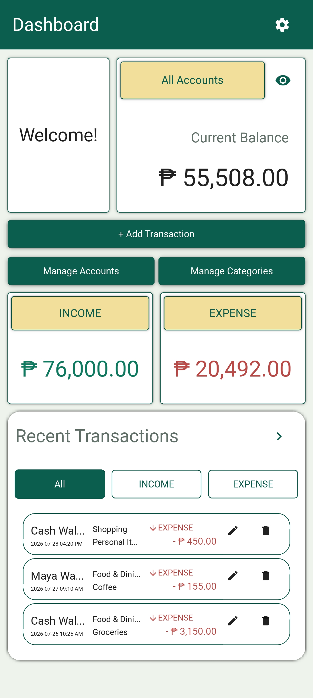
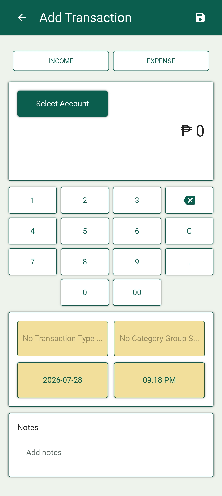
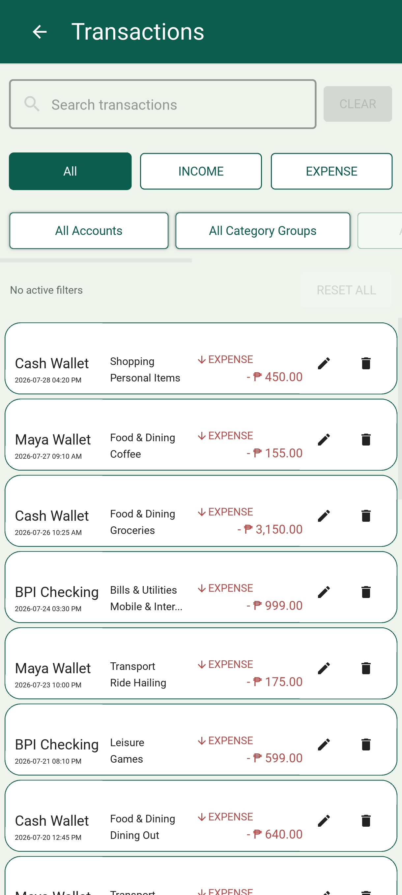
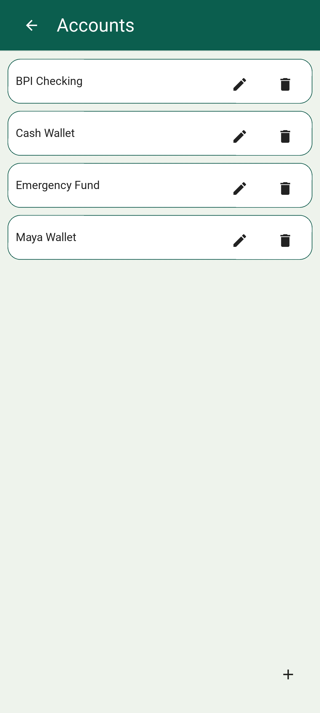
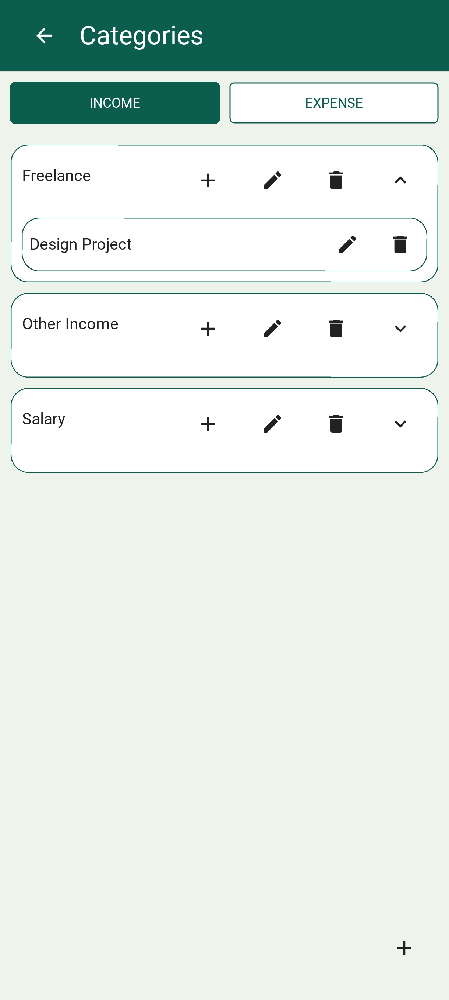
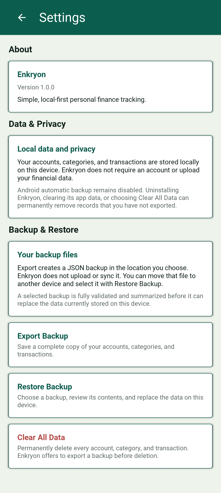

# Enkryon

A modern **offline-first personal finance tracker** built with **Python**, **Kivy**, **KivyMD**, and **SQLite**.

Enkryon is an offline-first personal finance tracker that helps users record income and expenses, organize accounts and categories, and monitor their financial activity through a clean and intuitive interface.

The application focuses on simplicity, local data privacy, and responsive mobile design.

---

## Screenshots

### Dashboard



### Add Transaction



### Transaction History



### Accounts



### Categories



### Settings



---

## Features

### Dashboard

- View current balance
- View total income
- View total expenses
- Filter dashboard by account
- Quick access to common actions

### Transactions

- Add income transactions
- Add expense transactions
- Edit transactions
- Delete transactions
- Custom numeric keypad
- Select account
- Select category group
- Select category
- Add notes
- Date and time selection

### Accounts

- Create accounts
- Rename accounts
- Delete accounts
- Duplicate name validation

### Categories

- Separate income and expense categories
- Category groups
- Nested categories
- Expand / collapse category groups
- Rename category groups
- Rename categories
- Delete category groups
- Delete categories
- Duplicate name validation

### Transaction History

- View all transactions newest-first
- Search notes, accounts, category groups, and categories
- Filter by transaction type, account, category group, and category
- Filter by an inclusive date range
- Combine search and filters
- Review active filters and reset them together
- Edit transactions
- Delete transactions

### Settings

- Export a versioned JSON backup
- Preview and restore a validated backup
- Clear all application data
- Export a backup before clearing data
- View application, local-data, and privacy information

---

## Download

Official Android APKs are published on the GitHub Releases page after their
release checks pass.

The version 1.0 candidate uses this artifact name:

```
Enkryon-v1.0.0.apk
```

---

## Technologies

- Python 3.13
- Kivy 2.3.1
- KivyMD 1.2.0
- SQLite

---

## Project Structure

```
enkryon/

├── .github/         # Automated GitHub quality checks
├── assets/          # Images, icons, screenshots
├── database/        # SQLite repositories
├── docs/            # Audit and development documentation
├── kv/              # Kivy UI layouts
├── screens/         # Screen controllers
├── services/        # Business logic
├── tests/           # Automated tests
├── theme/           # Shared design values and app theme
├── utils/           # Helper utilities
├── widgets/         # Reusable UI components
├── LICENSE
├── main.py
├── ROADMAP.md
├── requirements-dev.txt
├── requirements.txt
└── README.md
```

---

## Database

Enkryon uses **SQLite** for local data persistence.

Stored data includes:

- Accounts
- Category Groups
- Categories
- Transactions

Transaction amounts are stored as exact integer centavos. Ordered database
migrations safely upgrade older installations while preserving records,
relationships, transaction IDs, and totals.

Repository modules separate database operations from the user interface to
improve maintainability and testing. See the
[database architecture guide](docs/development/database.md) for details.

Named records carry database results across layer boundaries. Managed
connections protect commits, rollbacks, and cleanup, while account,
category, and transaction services own workflow rules and return explicit,
testable results to the interface.

User-created backups are stored as versioned JSON documents. Enkryon
validates the complete backup, shows its metadata and record counts, and
requires explicit confirmation before replacing current data inside a
database transaction.

On Android, the system document picker lets users choose where to save or
open a backup without granting broad storage permission. Android automatic
cloud backup remains disabled.

---

## Development and Quality Checks

Install the reproducible development environment:

```bat
python -m pip install -r requirements-dev.txt
```

Run the full suite with coverage:

```bat
python -m pytest -q --cov --cov-report=term-missing
```

GitHub Actions installs the same dependencies, compiles the Python source,
and runs the complete test suite with coverage on every push and pull
request.

See the [local testing guide](docs/development/testing.md) for the verified
environment and all required commands.

---

## Installation

Download the latest APK from **GitHub Releases**.

Install the APK on an Android device.

> Android may require enabling installation from unknown sources because the application is not distributed through Google Play.

---

## Roadmap

Development follows a reliability-first sequence:

- Phase 1 established the safe architecture and design foundation.
- Phase 2 delivered exact centavo storage and safe database migrations.
- Phase 3 established reproducible local and automatic quality checks.
- Phase 4 established repeatable, permanently signed Android releases and
  proved an in-place upgrade from official `v0.4.0` to `v0.4.8` without
  data loss.
- Phase 5 simplified the architecture with named records, managed database
  connections, explicit transaction form state, workflow services, and
  shared screen-action helpers.
- Phase 6 improved existing workflows with preserved transaction form state,
  responsive layouts, clearer navigation, actionable empty states, and
  consistent customized overlays.
- Phase 7 added versioned backup export, complete validation, confirmed
  transactional restore, Android document selection, and backup-before-clear
  recovery.
- Phase 8 added transaction search, combined advanced filters, active-filter
  summaries, clear no-results recovery, and indexed large-history queries.
- Phase 9 verifies clean installation, legacy upgrades, backup and recovery,
  10,000-record histories, responsive layouts, enlarged fonts, accessibility,
  and the signed version 1.0 release candidate.
- Later phases cover major feature expansion after the version 1.0 gate.

See the [complete development roadmap](ROADMAP.md) for objectives,
deliverables, priorities, and completion gates.

---

## Highlights

- Built entirely with Python
- Mobile-first interface using KivyMD
- Offline-first architecture
- SQLite local database
- Exact integer-centavo calculations
- Versioned, transactional database migrations
- Repository pattern for database access
- Reusable custom UI components
- Automated tests with coverage reporting
- GitHub Actions quality checks
- Android deployment using Buildozer
- Versioned, validated user-controlled backups
- Transactional replacement restore with rollback protection
- Combined transaction search and advanced filters
- Indexed newest-first transaction history
- Virtualized large-history rendering

---

## License

Copyright (c) 2026 Christian Jay Villaria. All rights reserved.

The source code and repository materials are available only for viewing and
portfolio evaluation. No permission is granted to copy, modify, distribute,
or reuse them in another project. Public repository hosting terms may still
permit platform-level viewing and forking.

See [LICENSE](LICENSE) for the complete terms.
